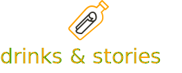

# 

Offers online drinks tastings from across the world – live, with and without alcohol

**THIS IS A NON-COMMERCIAL-PROJECT AS FINAL THESIS FOR MY WEB DEVELOPER BOOTCAMP AT [neue fische](https://www.neuefische.de/)**

drinks & stories is an app where beverage producers, distributors, or simply enthusiasts host virtual drinks tastings live. Ranging from soft drinks, mixed drinks, wine, beer to tea, and coffee — there is an event for every taste.

Current version: 1.0 || 11.10.2020

## 📲 Design and layout infos

The app is designed and laid out for smartphone screens, so adjust the settings in your view accordingly to IPhone 5 or 6/7/8.

## 🔧 Development

### Requirements

Node.js and npm

### 👨‍💻 Install all dependencies

`npm install`

Since there is a postinstall, the system automatically searches the client folder and installs the required dependencies there, too.

### 💻 Run dev server with:

`npm run dev`
